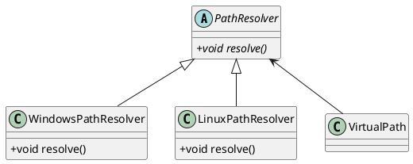

<span class="text-grey-dk-000">Куб материала `PrototypeGrid`</span>

# Девлог #4: Система материалов

Главная тема этого девлога - система материалов. Эта система выполняет роль связующего звена между шейдерным кодом и C++ стороной. Своеобразные материалы существовали в движке и до этого. Как правило, они являлись обычными классами-наследниками `BaseMaterial`. К примеру, класс материала для обычных объектов, вроде стен, пола, колонн и проч., выглядел примерно так:

```cpp
class Material : public BaseMaterial {
    glm::vec3 ambientMultiplier;
    glm::vec3 diffuseMultiplier;

    // ...

    void passToShader(Shader& shader, const std::string& structName) const override;
};
```

Этот подход долгое время работал исправно, однако он обладает одной крайне важной проблемой: создание новых материалов потребовало бы модификаций исходного кода движка, т. е. пользователи не смогли бы добавлять нужные им материалы, что крайне ограничило бы графическую кастомизацию движка. 

## Небольшой приквел: система проектов

Создание системы материалов является логическим продолжением процесса, который стартовал немного раньше: движок постепенно переходит на data-driven рельсы. Определения сущностей, ассетов, материалов и прочих специфичных для конкретного проекта вещей выносятся из исходного кода движка. Все эти вещи будут храниться в созданных пользователем файлах и, возможно, в будущем управляться скриптами. 

Система проектов решает сразу несколько задач, связанных с загрузкой пользовательских данных. Однако она даже близко не завершена, я планирую передать часть её полномочий другим системам. А пока рассмотрим, что она умеет.

### Виртуализация файловой системы

Прежде чем решать задачу "Как десериализовать ассет?", нужно решить "Откуда взять ассет?". Поэтому первая вещь, которой я занялся - виртуализация файловой системы. Я добавил две дополнительные точки входа, чтобы программисту не приходилось каждый раз самостоятельно строить пути к нужным ему файлам:

1. `fs://` - в этой точке входа корень файловой системы соответствует корневому каталогу проекта. К примеру, путь `fs://assets/shaders/myShader.glsl` движок раскроет в `/path/to/project/assets/shaders/myShader.glsl`.

2. `core://` - эта точка входа ведёт к ассетам, которые являются обязательными для работы движка и хранятся в специальном каталоге core. К примеру, `core://assets/textures/missing.png` (текстура, которую движок ставит, если в модели текстура отсутствует) становится `/path/to/core/assets/textures/missing.png`.

Когда я реализовывал это на C++, я создал специальный класс `VirtualPath`. Мне было крайне важно избежать синтаксиса вроде `func(VirtualPath(path).resolve())`. Для этого я сделал несколько неявных конструкторов, включая `VirtualPath(const std::string&)` и `VirtualPath(const std::filesystem::path&)`. Далее изменил сигнатуру методов и функций, работающих с файловой системой (словом, таких функций было гораздо меньше, чем их вызовов), заменив аргументы вида `const std::string& path` на `const VirtualPath& path`. Благодаря этому компилятор автоматически приводит типы аргументов к `VirtualPath`, позволяя удобно писать `func("fs://some/path")`.

### Платформонезависимые пути

Продолжая тему с виртуализацией ФС, решил добавить в VirtualPath функционал для генерации разных путей под каждую конкретную операционную систему. Сам процесс сборки путей уже был удобно изолирован в отдельный класс - `PathResolver`, поэтому самым очевидным решением было пронаследовать несколько реализаций:



Я ещё написал не все реализации. Windows *вроде бы более-менее* в большинстве ситуаций примет Linux-путь, поэтому я пока что просто сделал `GeneralPathResolver`. Чуть позже я сделаю полноценную реализацию и `WindowsPathResolver`, и `LinuxPathResolver`, когда буду подготавливать движок к полноценной кроссплатформенной работе, об этом, скорее всего, выйдет отдельный девлог. Пока что эта задача неприоритетная.

### Информация о проекте 

Теперь в каждом проекте должен содержаться `project.json` (по пути `fs://project.json`). Он хранит название проекта, версию, версию движка, под которую сделан проект. Например, так выглядит `project.json` демонстрационного проекта: 

```json
{
    "name": "Demo project",
    "projectVersion": "1.0.0",
    "engineVersion": "0.0.1"
}
```

На самом деле в настоящее время `project.json` почти бесполезен - это, скорее, задел на будущее, когда в нём будут хранится информация о конфигурации движка, используемых плагинах и т. п. Пока что единственное, что делает этот файл - задаёт название окну, используя поле `name`:


<span class="text-grey-dk-000">Название окна взято из поля `name`</span>

## Система материалов

Как и говорилось во введении, главная цель создания этой системы - сделать возможным определять материалы во время исполнения. Но есть и вторая, не менее важная - связать GLSL и C++. Нужно, чтобы рендерер в зависимости от объекта понимал какой шейдер ему использовать и как им пользоваться. До этого все объекты отрисовывались одним и тем же шейдером. 

### Новая архитектура системы материалов

Теперь материал определяет способ рендеринга объекта. Материал содержит указатель на шейдер, которым объект должен быть отрендерен. Но это самая лёгкая задача, которую решает материал. Ему также нужно хранить информацию, чтобы этим шейдером правильно воспользоваться. Он должен знать о свойствах, которые нужны шейдеру, их типах и значениях.

Самое интуитивное решение - создать класс-контейнер значений свойств. Однако часто случается, что объекты одного и того же материала имеют разные параметры. К примеру, если мы создадим металлический материал `GoldMaterial`, который будет накладывать золотой фильтр, объекты `GoldCoin` и `GoldIngot`, скорее всего, будут иметь некоторые различия в свойствах. К примеру, у них, скорее всего, будет разная текстура. Возможно, разработчик захочет сделать им разные множители к отраженному свету - `GoldCoin` может быть более отполированной, или, наоборот, более потертой чем `GoldIngot`. 

Чтобы решить эту проблему, я разделил материал на две разные сущности:

1. `Material` - содержит *схему* материала: имена свойств, типы свойств, дефолтные значения.

2. `MaterialInstance` - содержит данные конкретного объекта. Все значения свойств, которые не соответствуют дефолтным хранятся здесь.

**Неудачное техническое решение #1:** изначально я думал, что в `MaterialInstance` можно хранить *только* те поля, значения которых отличаются от дефолтных. Звучало как отличная, причём простая в реализации экономия памяти, однако от этого был вынужден отказаться. Если в `MaterialInstance` лежит полная копия данных `Material`, на шейдер это можно отправить одной операцией копирования, причём отправить можно сразу несколько экземпляров `MaterialInstance`. Если же мы храним только отличающиеся поля, то сначала мы должны полностью скопировать все данные родительского `Material`, после чего отдельно скопировать каждое свойство. Подробнее про передачу данных материалов будет в разделе про хранение свойств.

### Хранение свойств

Читатели, знакомые с C++, уже заметили сложность: `Material` должен уметь хранить данные разных типов. Я уже описывал type erasure в одном из предыдущих девлогов, однако в данном случае он нам не подойдёт - хранить свойства нужно так, чтобы их можно было быстро передать видеокарте. 

Решение которое я использовал до системы материалов - простое, но неэффективное. Я просто объявлял нужные мне униформы на шейдере, после чего передавал их через `glUniform()`. В целом передача униформы в OpenGL не является медленной операцией, но они не могут различаться в batch-запросах, что будет критично в будущем обновлении рендерера, поэтому я решил от них отказаться. 

Вместо униформ я решил использовать SSBO, в который записал бы свойства, после чего мне было бы достаточно передать только ID материала униформой `u_CurrentMaterialStartId`. Позже, когда я займусь батчингом, смогу легко заменить `u_CurrentMaterialStartId` на атрибут вершины.

{: .note }
Пока писал этот девлог, узнал о существовании UBO (Uniform Buffer Object). Кажется, в нём содержится функционал, который сделает вышеописанный процесс ещё проще в реализации.

Как я и писал ранее, SSBO - специальный массив на видеокарте. Как и с другими массивами, записать в него сразу несколько типов нельзя. Поэтому я решил использовать SSBO просто как блок памяти: на C++-стороне я представляю свойства просто как набор байт. На стороне OpenGL байты распаковываются обратно в переменные различных типов специальным автоматически сгенерированным кодом.

{: .note }
В GLSL нет ни `uint8`, ни `uint16`. В результате этого для скорости и удобства работы свойства выравниваются по 4 байтам. Т. е. размер `bool` в этой системе фактически составляет 4 байта (32 бита).

Рассмотрим подробнее теперь, как это работает на стороне C++. Для реализации я создал 3 класса:

1. `MaterialLayout` - его задача определить, какой участок памяти будет занимать то или иное свойство внутри памяти, выделенной под материал. Для этого свойства выравниваются, сортируются и т. п. Некоторые из этих операций могут быть проделаны, только когда `MaterialLayout` уже "готов" (одна из таких операций - выделение памяти. Она выделяется только в конце, в силу архитектуры `MaterialDataBuffer` (см. ниже)) - все свойства были определены. Это включается методом `.finalize()`, далее я буду называть это состояние *финализованным*.

2. `PropertyDataStorage` - непосредственно хранит данные свойств в соответствие с финализованным `MaterialLayout`. 

3. `MaterialDataBuffer` - фактически кастомный аллокатор для материалов. Когда создаётся экземпляр `PropertyDataStorage`, он обращается к `MaterialDataBuffer` и получает своеобразный указатель. Из-за того, что у разных материалов могут быть разные размеры, я пока не стал реализовывать операцию удаления материала - логика `MaterialDataBuffer` стала бы крайне нетривиальной, а острой нужды в операции удаления нет. Пока что вся память, выделенная `MaterialDataBuffer`, будет освобождаться один раз - при удалении объекта `MaterialDataBuffer`.

### MaterialBuilder

После введения `.finalize()` у `Material` появилось целое второе состояние (также финализованное), когда некоторые методы обрабатываются совершенно по-разному. Чтобы избежать `if`-ов в каждом методе, я решил немного поменять назначение `Material`: теперь он представляет готовый материал, у которого схема уже зафиксирована. Чтобы не переносить на пользователя задачу ручной инициализации и передачи всех объектов, необходимых для `Material`, я применил порождающий паттерн "строитель", создав класс `MaterialBuilder`. Его единственная цель - создать объект `Material`, сохранив для пользователя удобное API. В коде выглядит это так:

```cpp
Material prototypeGrid = MaterialBuilder(
    "PrototypeGrid", ...
).addProperty<glm::vec3>("baseColor", glm::vec3(0.8, 0.8, 0.8))
    .addProperty<float>("tilingScale", 1.0f)
    .finalize(globalMaterialBuffer);
```

### Кодогенератор

Как я уже упоминал выше, распаковка данных из SSBO генерируется автоматически. Этот код довольно простой, к примеру, так выглядит код распаковки одного из материалов:

```cpp
void loadCurrentMaterial() {
    uint base = u_CurrentMaterialStartId;
    currentMaterial.diffuseMap = uvec2((b_MaterialData[base + 0]), (b_MaterialData[base + 1]));
    currentMaterial.specularMap = uvec2((b_MaterialData[base + 2]), (b_MaterialData[base + 3]));
}
```

Функция `main()` также генерируется автоматически, откуда и вызывается `loadCurrentMaterial()`. Пользователь получает доступ к полям материала в виде удобной структуры, сгенерированной на основе соответствующего материала.

Генерация определения материала - далеко не единственное, что делает кодогенератор. Крайне удобным оказалось возложить на него также генерацию определений униформ, SSBO, структур и проч.

**Неудачное техническое решение #2:** изначально роль связки C++ и GLSL планировалось возложить на препроцессор. Однако его функционала не хватило для этой задачи, в результате чего он стал довольно бесполезен. Сейчас он поддерживает единственную директиву `//@import` и я вероятно вырежу его, если не смогу придумать ему лучшее применение. 

### Подробнее про текстуры 


<span class="text-grey-dk-000">Баг, возникший во время разработки: все текстуры были заменены на дефолтную missing.png</span>

Текстуры в материале хранятся несколько обособленно от остальных свойств. В отличие от других типов, в SSBO текстуры не положить, придётся передавать через униформу. Или всё же можно? Пока я писал систему материалов, я узнал об одном очень удобном расширении OpenGL: `GL_ARB_bindless_texture`. Это расширение позволяет заранее загружать текстуры в видеопамять, после чего передавать на шейдер только 64-битные дескрипторы (которые уже можно положить в SSBO). Далее мы будем называть текстуры, загруженные таким образом, *bindless-текстурами*.

Возможность отказаться от использования униформы при передаче bindless-текстуры - далеко не единственное, чем полезно это расширение. Согласно стандарту OpenGL количество текстур, переданных через униформу на шейдер, лимитировано. Гарантированный стандартом минимум - всего 16<sup>*</sup>. Это будет сильно ограничивать графические возможности, особенно в сложных шейдерах. 

{: .note }
<sup>*</sup> - многие современные драйверы поддерживают 32 и более семплеров. Хотя даже так OpenGL предлагает встроенные способы передать гораздо больше текстур. Можно создать массив текстур (если у них совпадёт разрешение) или слепить текстурный атлас. Однако все эти способы гораздо сложнее в реализации, чем bindless-текстуры, т. е., скорее всего, я не буду имплементировать их без острой необходимости.

Несмотря на удобство, у bindless-текстур есть один критический недостаток: относительно низкая поддержка. Даже в 4.6 bindless-текстуры не стали частью стандарта OpenGL. Они отлично поддерживаются на всем современном железе, вроде GPU от AMD или Nvidia. Но на более старых машинах, например использующих встроенную графику Intel, могут возникнуть проблемы с поддержкой. 

Чтобы оставить движок доступным на большинстве устройств, я решил добавить режим совместимости, при котором текстуры будут передаваться на шейдер старым способом. Надеюсь, со временем, смогу от него отказаться, ведь некоторые графические фичи на нём, скорее всего, не будут поддерживаться. 

К низкой поддержке также относятся проблемы с тулингом. Многие инструменты (например, RenderDoc) не поддерживают bindless-текстуры по различным причинам. Дебажить без них было бы гораздо менее приятно, поэтому в будущем я могу превратить режим совместимости в своеобразный дебаг-инструмент.

## Материал PrototypeGrid

В качестве демонстрации новой системы решил сделать простой материал, который разработчики могли бы использовать для прототипирования. Это простая сетка, прикрепленная к глобальным координатам. Текстура процедурно генерируется во время геометрического прохода, что позволяет выбирать любой цвет и масштаб. 


<span class="text-grey-dk-000">`PrototypeGrid` с другими параметрами</span>

Давайте по-подробнее рассмотрим, как это было реализовано с использованием новой системы. Я создал материал `PrototypeGrid` с двумя полями:

```cpp
std::shared_ptr<Material> prototypeGrid = std::make_shared<Material>(
    MaterialBuilder(
        "PrototypeGrid", MaterialGraphicsConfig(), assetManager
    )
    .addProperty<glm::vec3>("baseColor", glm::vec3(0.8f, 0.8f, 0.8f))
    .addProperty<float>("tilingScale", 1.0f)
    .finalize(globalMaterialBuffer)
);
```

Из интересного здесь - `MaterialGraphicsConfig`. У материалов потенциально может появиться множество настроек, связанных с рендерингом. Чтобы не создавать в `Material`, `MaterialInstance` и проч. много одинаковых полей, в качестве временного решения объединил их в `MaterialGraphicsConfig`. Сейчас эта структура рискует постепенно стать "местом, где хранится всё". Как только я обновлю графическую систему, постараюсь вырезать `MaterialGraphicsConfig` из системы.

Рассмотрим GLSL, который был сгенерирован на основе этого материала. Первое интересное место - структура материала:

```cpp
struct Material_Structure_PrototypeGrid {
    vec3 baseColor;
    float tilingScale;
};

Material_Structure_PrototypeGrid currentMaterial;
```

Префикс "Material_Structure_" добавлен, чтобы название автоматического определения, *скорее всего,* не совпало с каким-то названием из пользовательского кода. Изначально я хотел сделать скоупинг, но без построения АСТ GLSL (что я делать не очень хотел), эта задача быстро превратилась бы в кошмар, поэтому эту идею я пока отложил.

Далее кодогенератор сгенерировал функцию распаковки, которая вызывается из автоматически сгенерированного `main()`:

```cpp
void loadCurrentMaterial() {
    uint base = u_CurrentMaterialStartId;
    currentMaterial.baseColor = vec3(uintBitsToFloat(b_MaterialData[base + 0]), uintBitsToFloat(b_MaterialData[base + 1]), uintBitsToFloat(b_MaterialData[base + 2]));
    currentMaterial.tilingScale = uintBitsToFloat(b_MaterialData[base + 3]);  
}

void main() {
    loadCurrentMaterial();

    fragment();
}
```

После `loadCurrentMaterial()` сразу идёт `fragment()` - эта функция определяется пользователем (в вершинном шейдере вызывается `vertex()`).

Сейчас сгенерированные шейдеры замещают геометрический проход deferred-пайплайна, что блокирует доступ к кастомному освещению. Позже, когда я буду заниматься графикой, я добавлю возможность для некоторых объектов быть отрендеренными используя forward, что даст возможность реализовать что угодно. Однако даже сейчас функционала хватает для простых задач. К примеру можно написать множество Жюлиа:


<span class="text-grey-dk-000">Код этого шейдера доступен в репозитории, demo/assets/shaders/julia</span>

## Заключение

После завершения работы над материалами я упёрся в недостаток функционала в графической системе. Скорее всего, следующий девлог будет про рефактор и доработку этой системы.
